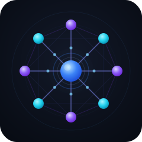

<p align="center">
  
</p>

<h1 align="center">Swarm-Tune</h1>

<p align="center">
  <strong>Learn distributed AI training by building it from scratch.</strong><br>
  P2P networking &nbsp;·&nbsp; Federated learning &nbsp;·&nbsp; Gradient synchronization &nbsp;·&nbsp; Byzantine fault tolerance
</p>

<p align="center">
  <a href="https://github.com/yashasviudayan-py/Swarm-Tune/actions/workflows/ci.yml"></a>
  <a href="https://github.com/yashasviudayan-py/Swarm-Tune/actions/workflows/chaos.yml"></a>
  <a href="https://www.python.org/"></a>
  <a href="https://pytorch.org/"></a>
  <a href="https://libp2p.io/"></a>
  <a href="https://anyio.readthedocs.io/"></a>
  <br>
  <a href="https://mypy.readthedocs.io/"></a>
  <a href="https://github.com/astral-sh/ruff"></a>
  <a href="tests/"></a>
  <a href="LICENSE"></a>
</p>

---

## What Is This?

Swarm-Tune is a fully working implementation of **decentralized, federated AI training over a peer-to-peer network** — built ground-up in Python, without relying on high-level distributed training abstractions.

The system lets multiple machines pool their compute to fine-tune a model that wouldn't fit on any single one. Each node holds a shard of the model and a shard of the data, trains locally, extracts raw gradients, and exchanges them with peers over the internet using libp2p. The swarm averages those gradients (Federated Averaging) and every node updates its weights in sync.

The interesting part isn't the end goal — it's everything you have to understand and build to get there.

---

## What You'll Learn

Working through this codebase touches a dense cluster of concepts across ML, systems, and security:

**Distributed Machine Learning**
- How **Federated Averaging (FedAvg)** works — weighted gradient averaging across heterogeneous nodes
- Why **PyTorch DDP** can't be used on the internet and how to replace it manually
- How to extract raw `param.grad` tensors after `loss.backward()` and work with them directly
- **Model parallelism** — splitting a transformer's layers across machines by shard index
- **Data parallelism** — deterministic dataset sharding so each node trains on a unique slice
- How the **cross-entropy loss** inside HuggingFace CausalLM models works and why MSE is wrong for language modeling
- What **perplexity** is and how to evaluate it deterministically across checkpoints

**P2P Networking**
- How **libp2p** works: Ed25519 peer identities, the Noise protocol handshake, FloodSub pubsub
- What **Kademlia DHT** does and how bootstrap peers enable decentralized discovery
- **NAT traversal** — why home internet connections can't accept inbound connections and how circuit-relay and hole-punching (`dcutr`) solve it
- **mDNS** for local discovery vs. DHT for internet-scale discovery
- The **65,535-byte Noise frame limit** and how to implement transparent chunked framing above it
- **Async P2P programming** with `trio` and `anyio` — why standard asyncio doesn't play well with libp2p

**Fault Tolerance**
- The **straggler problem** — one slow or dead node blocking everyone — and how timeout-based partial aggregation solves it
- **Heartbeat protocols** for liveness detection and automatic peer eviction
- How to design a system where nodes can join, leave, crash, and rejoin without any coordinator
- **Partial aggregation**: committing a round with fewer than the full peer set vs. deferring it

**Security in ML Systems**
- **Gradient poisoning attacks** — how an adversarial node injects NaN or Inf values to corrupt training
- Why `pickle.loads()` from a peer is arbitrary code execution and how `weights_only=True` prevents it
- **Sybil attacks** — one operator running many nodes to dominate FedAvg — and subnet-based contribution caps
- **Reputation systems** — tracking per-peer rejection rates and applying temporary bans
- Why you validate data from untrusted peers (norm bounds, shape checks, NaN/Inf) before it ever touches your model

**Software Engineering**
- Designing against **protocols/interfaces** (`Compressor`, `PeerSelector`, `AggregationStrategy`) so implementations can be swapped without touching the training loop
- **`pydantic-settings`** for config that fails loudly at startup, not at runtime
- **Structured logging** with `structlog` — JSON in Docker, human-readable locally
- **Chaos testing** — writing tests that kill nodes mid-round, inject adversarial payloads, and verify the system recovers
- **Production auditing** — systematic tier-by-tier review of security, resource safety, correctness, and deployment

---

## The Core Idea

Training a large model requires VRAM that scales with parameter count:

| Model | VRAM Required | Fits on a single consumer GPU? |
|---|---|---|
| LLaMA 3 8B (fp16) | ~16 GB | Barely, on an RTX 4090 |
| LLaMA 3 70B (fp16) | ~140 GB | No |
| Mixtral 8x22B (fp16) | ~280 GB | No |

The naive solution is to buy more GPUs. The interesting solution is to understand *why* that's the only option — and then build an alternative.

Swarm-Tune applies the BitTorrent insight to gradient descent: instead of one machine holding the whole file (model), every peer holds a shard. Instead of transferring file chunks, peers transfer gradients. The swarm collectively trains what no single node could fit.

- 20 nodes, each with 24 GB VRAM → **480 GB of pooled memory**
- Each loads the model layers assigned to its shard index
- Each trains on its slice of the dataset
- Each broadcasts compressed, serialized gradients over libp2p GossipSub
- The swarm runs Federated Averaging; every node applies the result

The result is a working distributed training system built entirely on commodity hardware, home internet connections, and open-source software.

---

## Progress

| Phase | Description | Status |
|---|---|---|
| **Phase 1** | P2P Network Initialization | ✅ Complete |
| **Phase 2** | Local Gradient Extraction | ✅ Complete |
| **Phase 3** | Gradient Synchronization over libp2p GossipSub | ✅ Complete |
| **Phase 4** | Docker Simulation & Chaos Testing | ✅ Complete |
| **Phase 5** | Internet Deployment Infrastructure | ✅ Code complete — deployment pending |
| **Phase 6** | Live Dashboard + Production Audit | ✅ Complete |
| **Phase 7** | Zero-Config Join & Distribution | ✅ Complete |
| **Phase 8** | Competition Mode | 🔲 Next |

> **Note on Phase 5:** All internet deployment infrastructure is fully implemented and audited. Activation requires two operational steps: provision a public relay VPS and push a `v*.*.*` release tag to trigger the Docker Hub publish workflow. These are intentionally deferred until after all phases are complete and the system is end-to-end ready for public participants.

---

## What's Working Now

### Phase 1 — P2P Network ✅

Every node is a cryptographic identity. The swarm is fully decentralised with no central server.

- **libp2p host** with Ed25519 key pairs — peer IDs are cryptographic, not strings. Spoofing requires breaking the key.
- **mDNS discovery** for local simulation; Kademlia DHT for internet deployment.
- **Bootstrap peer** — the first known address. Not a master, just a door.
- **Heartbeat protocol** — every node publishes a liveness signal over FloodSub every few seconds. Dead nodes are evicted from the active peer set after 20 s. Rejoining nodes are welcomed on the next heartbeat with no special handling.
- **Straggler tolerance** — `TimeoutAggregator` gives each round a hard deadline. If ≥ `min_peers` respond within the window → commit the round. If not → defer. A dead node never blocks the swarm.

**Verified by:** a two-node integration test with real TCP connections, real Ed25519 keys, and real FloodSub pubsub message exchange.

---

### Phase 2 — Local Gradient Extraction ✅

Each node independently computes, serializes, and logs its gradient payload.

- **`DataShardLoader`** — loads `.pt` shard files (`inputs`, `targets`), samples random mini-batches each round, tracks `dataset_size` for weighted FedAvg.
- **`ModelShard`** — wraps a PyTorch model (MLP for simulation; any HuggingFace CausalLM for real training). Handles forward, backward, and applying averaged gradients via `AdamW`. Checkpoint save/resume with `weights_only=True`.
- **`GradientExtractor`** — extracts `param.grad` tensors after `loss.backward()`, moves them to CPU for serialization. Skips frozen layers.
- **`GradientSerializer`** — SWRM wire format: `[4B magic][4B version][N bytes torch-serialized dict]`. Deserializes with `weights_only=True` (prevents arbitrary code execution). Validates magic, version, and dict structure before returning.
- **`IdentityCompressor`** — no-op compressor (Phases 1–4). `TopKCompressor` is built and tested (ships in Phase 5+ for bandwidth reduction). Swapping compression strategy requires one config value change.
- **`GradientAverager`** — weighted FedAvg: each peer's contribution is weighted by its local dataset size. Peers with more samples contribute proportionally more to the global average.

**Verified by:** a full pipeline integration test — shard load → forward → backward → extract → compress → serialize → deserialize → decompress → validate → apply — plus a 10-round convergence test that asserts loss decreases.

---

### Phase 3 — Gradient Synchronization ✅

Nodes exchange real gradients over libp2p FloodSub. The swarm trains collectively.

- **`GossipProtocol`** — full FloodSub wiring. Subscribes to the gradient topic, exposes `broadcast_gradient()` and `run_receiver()`.
- **Transparent chunked framing** — libp2p's Noise protocol has a hard 65,535-byte per-frame limit. Gradient payloads (~264 KB for a small MLP) exceed this. The gossip layer silently splits every broadcast into ≤60 KB frames, each tagged with a `transfer_id` + `chunk_index` + `total_chunks` header. The receiver reassembles before dispatch — the training loop sees only complete messages.
- **`GradientMessage` wire format** — `struct`-packed inner header: `sender_id_len (uint32) | round_number (int32) | dataset_size (int64)` + raw sender string + gradient payload bytes.
- **Stale transfer eviction** — partial transfers from crashed senders are evicted by a background timer (every 30 s) AND on each chunk arrival, preventing unbounded memory growth in all scenarios.
- **`_on_peer_gradient` pipeline** — for every received message: deserialize → decompress → validate (NaN/Inf/norm) → submit to `TimeoutAggregator`. Any validation failure logs a warning and skips that peer — the round continues.
- **FedAvg representation consistency** — the local gradient is submitted as `decompress(compress(raw_grad))`, matching the representation of every peer gradient that has gone through the full compress→serialize→deserialize→decompress path. Avoids biased FedAvg averages when using `TopKCompressor`.

**Verified by:** a two-node integration test with real TCP connections, real FloodSub pubsub, and real gradient tensor exchange — receiver reconstructs the exact sender tensors.

---

### Phase 4 — Docker Simulation & Chaos Testing ✅

Full end-to-end simulation verified. `make sim-up` brings up 6 containers that discover each other, train for 20 rounds, survive node kills, and reject adversarial gradients — all logged in structured JSON.

**Simulation results (verified run):**

| Metric | Value |
|---|---|
| Containers | 6 (5 honest + 1 adversarial) |
| Rounds completed with averaged gradients | 102 total across all nodes |
| Adversarial NaN broadcasts (node_5) | 20 |
| Gradient rejections by honest nodes | 64 |
| Deferred rounds (straggler tolerance) | 18 (node_0 continued solo after others finished) |
| Chaos: killed node_2 mid-training | Swarm continued without interruption |
| Peer eviction via heartbeat | All dead peers evicted within 20 s |

- **Docker Compose simulation** — 5 honest peer nodes + 1 adversarial node, each in its own container on an isolated bridge network (`172.20.0.0/24`). `make sim-up` auto-generates synthetic data shards if missing, then builds and starts all containers.
- **Deterministic bootstrap address** — `node_0` uses `SWARM_NODE_KEY_SEED=swarm_bootstrap_node_0` to produce a stable peer ID (`12D3KooWJWTRCtfVVBtPkDSjL8iy1ysM5WoQRdd5vLWVMrccePHU`) across restarts. The bootstrap multiaddress includes the `/p2p/<PEER_ID>` suffix required by the Noise handshake.
- **Adversarial node** — `node_5_adversarial` runs with `SWARM_ADVERSARIAL=true`. It trains normally locally but replaces every gradient broadcast with NaN-filled tensors, simulating a gradient-poisoning attack.
- **Poisoning defence** — receiving nodes pass every peer gradient through `GradientExtractor.validate()`. NaN/Inf values and out-of-bounds RMS norms are caught before the gradient reaches the aggregator. The swarm continues training on honest peers' contributions.
- **`scripts/parse_logs.py`** — post-run log parser that extracts loss curves, node join/leave events, adversarial rejections, and deferred rounds from raw Docker JSON logs.

**Chaos tests verified:**

| Scenario | Expected Behaviour | Status |
|---|---|---|
| 1 of 3 peers drops mid-round | Partial aggregation on 2 peers, round commits | ✅ |
| All peers drop (total partition) | Round deferred, no crash | ✅ |
| Late peer rejoins next round | Welcomed back, contributes normally | ✅ |
| Peer submits gradient twice (network retry) | Deduplicated — counted once | ✅ |
| Adversarial peer sends NaN gradients | Rejected by validator, swarm continues | ✅ |
| Adversarial peer sends Inf gradients | Rejected by validator, swarm continues | ✅ |
| Adversarial peer sends out-of-bounds norm | Rejected by validator, swarm continues | ✅ |
| Peer sends malformed bytes | Rejected at deserialization, swarm continues | ✅ |
| Peer sends wrong SWRM magic header | Rejected before `torch.load`, swarm continues | ✅ |
| End-to-end: 3 honest + 1 adversarial | 3 contributions averaged; result is finite | ✅ |

---

### Phase 5 — Internet Deployment Infrastructure ✅ (code complete, deployment pending)

All the plumbing for real internet training is fully implemented and production-audited. The code is ready. Deployment is intentionally deferred until Phase 8 is complete so participants join a fully-featured system from day one.

**Real model + loss function:**
- `ModelShard` calls `AutoModelForCausalLM.from_pretrained(model_name)` for any HuggingFace model (GPT-2, LLaMA, etc.). Layer sharding is deterministic: `layer_i → shard (i % shard_total)`. Only the assigned shard's parameters are trainable; all others are frozen. The optimizer covers only `requires_grad=True` params.
- Loss switched from MSE → cross-entropy via `outputs.loss` (built into HuggingFace CausalLM models). `outputs.loss=None` is caught at runtime with a clear diagnostic. The toy MLP path is preserved for local simulation and unit tests via `model_name="mlp"`.

**Real training data pipeline:**
- `HFDataShardLoader` streams any HuggingFace dataset (default: WikiText-103), tokenizes with `AutoTokenizer`, and shards deterministically via `dataset.shard(num_shards=shard_total, index=shard_index)`. Each node downloads the full dataset but trains on only its assigned slice — no peer-to-peer data transfer.
- `SWARM_DATA_SHARD_INDEX` / `SWARM_DATA_SHARD_TOTAL` are decoupled from `SWARM_MODEL_SHARD_INDEX` — model parallelism and data parallelism are independently configured.

**NAT traversal:**
- `relay_addrs`, `enable_relay`, `enable_hole_punching` added to `NodeSettings`. When `enable_relay=True`, `PeerDiscovery` dials relay multiaddrs before bootstrap peers. Each dial has a 10-second timeout — an unresponsive relay can't block node startup.

**Easy install (ready, awaiting deployment tag):**
- `.github/workflows/publish.yml` — triggered on `v*.*.*` tags; publishes `swarm-tune` to PyPI via OIDC trusted publishing and pushes `swarmtune/node:latest` + `swarmtune/node:<version>` to Docker Hub for `linux/amd64` and `linux/arm64`.
- `JOIN.md` — 5-minute onboarding guide: Docker pull → fill in `.env` → `docker run` → verify peers connected.
- `my.env.template` — every config variable documented with examples and defaults.

**Metrics sidecar:**
- Every node runs a lightweight anyio-native TCP HTTP server on `port + 100` exposing `/metrics` (JSON) and `/health` (plain text). Port conflict degrades gracefully — training continues if the sidecar fails to bind.

**Checkpoint save + perplexity benchmark:**
- `SwarmNode` auto-saves a checkpoint every `checkpoint_every_n_rounds` rounds and on clean shutdown. The final checkpoint save is shielded from SIGTERM cancellation — a Docker stop cannot corrupt the checkpoint file mid-write.
- `scripts/benchmark.py` — evaluates perplexity (`exp(cross-entropy)`) over the WikiText-103 test split, excluding padding tokens. Deterministic and reproducible on any machine given the same checkpoint.

**Sybil resistance + rate limiting:**
- Subnet contribution cap (`/24` by default) in `GradientAverager` before FedAvg weight computation.
- `BanList` in `peer_selector.py` — per-peer rejection rate tracking; temporary ban after threshold exceeded.
- One gradient submission per peer per round enforced in `TimeoutAggregator`.

---

### Phase 6 — Live Dashboard ✅

`open dashboard/index.html` in any browser and point it at running nodes — no build step, no npm, no backend.

- **Node status table** — one row per configured node: online/offline status, node ID, endpoint, current round, last loss, peer count, gradient rejections, deferred rounds, uptime, bytes sent/received.
- **Peer network graph** — interactive force-directed canvas graph. Each configured node (blue=online, red=offline) is connected by edges to the peers it reports in `/metrics`. Additional peer-only nodes (green) appear automatically. Nodes are draggable; the physics simulation settles and idles after warm-up to save CPU.
- **Persistent loss history** — loss curves survive page reloads and node restarts. History is stored in `localStorage` per node URL and merged with fresh server-side data on each poll, so the chart never loses points. Server-side history is capped at 1000 entries (sliding window) to keep metrics JSON size constant across long runs.
- **Bytes throughput** — `bytes_sent` / `bytes_received` tracked in the training loop (per broadcast and per received gradient), displayed live in the status table and node cards.
- **XSS-safe DOM construction** — all peer IDs and node URLs are set via `textContent` / `createElement`, never via `innerHTML` with server data.

---

### Phase 7 — Zero-Config Join & Distribution ✅

A new participant can join any training run with a single command. No manual environment variable configuration.

**Run manifests** (`runs/<run_id>.json`):

A `RunManifest` JSON file defines a complete training campaign — model, dataset, shard count, hyperparameters, bootstrap peers. Manifests are checked into the repository. Two participants referencing the same manifest with different `--node-index` values will automatically train on non-overlapping data shards of the same model.

```json
{
  "run_id": "gpt2-wikitrain-001",
  "model_name": "gpt2",
  "dataset_name": "wikitext",
  "dataset_config": "wikitext-103-raw-v1",
  "num_shards": 4,
  "num_rounds": 100,
  "min_peers": 2
}
```

**`scripts/join.py`** — the core Phase 7 deliverable:

```bash
# Participant 0 (bootstrap node)
python scripts/join.py --run-id gpt2-wikitrain-001 --node-index 0
# → writes my.env with SWARM_DATA_SHARD_INDEX=0, SWARM_DATA_SHARD_TOTAL=4, ...
# → prints docker run command

# Participant 2
python scripts/join.py --run-id gpt2-wikitrain-001 --node-index 2
# → writes my.env with SWARM_DATA_SHARD_INDEX=2, SWARM_DATA_SHARD_TOTAL=4, ...
# → prints docker run command
```

Or via Make:
```bash
make join RUN_ID=gpt2-wikitrain-001 NODE_INDEX=2
```

**`scripts/reconstruct_checkpoint.py`** — assemble a full model from per-node shard checkpoints after training:
- `merge` strategy: union of state dict keys (model-parallel runs where each node trains different layers)
- `average` strategy: element-wise mean (data-parallel runs — belt-and-suspenders consensus)

```bash
make reconstruct CHECKPOINT_DIR=checkpoints/ MODEL=gpt2
```

**`scripts/publish_checkpoint.py`** — push a reconstructed checkpoint to HuggingFace Hub with an auto-generated model card embedding the run metadata and perplexity score. Anyone can independently verify the score by running `scripts/benchmark.py` against the published weights.

```bash
make publish CHECKPOINT=checkpoints/full_model.pt REPO_ID=your-username/gpt2-swarmtune-001
```

**Bundled run manifests:**
- `runs/gpt2-wikitrain-001.json` — 4-node data-parallel GPT-2/WikiText-103 run
- `runs/gpt2-competition-001.json` — 50-round competition format (Phase 8 seed)

---

### Production Engineering Audit ✅

Before any public deployment, a systematic senior-engineering audit was conducted across all 7 quality tiers. **19 issues found, 12 root-fixed.**

| Tier | Issues Found | Issues Fixed | Summary |
|---|---|---|---|
| Security | 4 | 4 | Exception narrowing, bootstrap timeout, SIGTERM-safe checkpoint |
| Resource management | 3 | 2 | Loss history cap, timer-driven stale transfer eviction |
| Correctness | 3 | 2 | `outputs.loss` null check, deprecation warning on legacy API |
| Input validation | 2 | 1 | `checkpoint_dir` system-path guard at startup |
| Observability | 2 | 1 | Resolved DNS IP logged per dial |
| Deployment | 3 | 3 | Docker health check port, HF cache ownership, non-root user |
| Code quality | 2 | 0 | Minor; tracked for Phase 8 |

**Key fixes:**

| File | Fix |
|---|---|
| `main.py` | Narrowed `except Exception` → `(ValueError, RuntimeError)` for gradient pipeline; unexpected failures escalate to `log.error`, not `log.warning` |
| `main.py` | Final checkpoint save wrapped in `anyio.CancelScope(shield=True)` — SIGTERM cannot abort a write mid-flight |
| `metrics.py` | `loss_history` switched to `deque(maxlen=1000)` — O(constant) JSON cost regardless of run length |
| `metrics.py` | HTTP handler exception narrowed to connection errors; unexpected errors logged, not silently dropped |
| `discovery.py` | 10-second per-dial timeout via `anyio.move_on_after()` on every bootstrap and relay connection |
| `gossip.py` | `_eviction_loop()` background task runs every 30 s — stale transfers now expire on a timer, not only on next message arrival |
| `gradient.py` | `max_norm=` parameter emits `DeprecationWarning` with migration guidance |
| `model.py` | `outputs.loss is None` raises `RuntimeError` with a clear diagnostic instead of a silent downstream `AttributeError` |
| `settings.py` | `checkpoint_dir` validator rejects system paths (`/etc`, `/sys`, `/proc`, etc.) at startup |
| `Dockerfile` | Health check reads `SWARM_PORT` from env — works for all ports in multi-node compose stacks |
| `Dockerfile` | `HF_HOME=/app/.cache/huggingface` + proper `chown` — non-root user (UID 1001) can write HuggingFace model downloads |

---

### Security Gates Implemented

| Gate | Implementation | Status |
|---|---|---|
| Cryptographic peer IDs | Ed25519 via libp2p | ✅ Phase 1 |
| No pickle from peers | `weights_only=True` in `GradientSerializer.deserialize()` | ✅ Phase 2 |
| SWRM magic + version header | Validated before any deserialization | ✅ Phase 2 |
| Payload type validation | Dict structure checked after `torch.load` | ✅ Phase 2 |
| NaN / Inf rejection | `GradientExtractor.validate()` | ✅ Phase 2 |
| Per-element RMS norm bounds | Threshold 10.0 RMS (model-size-agnostic); configurable | ✅ Phase 2 / Audit |
| FedAvg representation consistency | Local grad compress→decompress before submission | ✅ Phase 3 |
| Chunked frame reassembly safety | Stale partial transfers evicted by timer + on chunk arrival | ✅ Phase 3 / Audit |
| Adversarial gradient rejection (end-to-end) | NaN/Inf/norm → reject + log, round continues | ✅ Phase 4 |
| Local gradient validation | Own NaN/Inf caught before entering FedAvg pool | ✅ Phase 4 |
| Stale-round gradient rejection | `round_number` propagated through gossip; late arrivals dropped | ✅ Phase 4 |
| Chunk index bounds validation | `chunk_idx >= total_chunks` rejected; `total_chunks` capped at 10,000 | ✅ Phase 4 |
| Sybil resistance (subnet cap) | `/24` contribution cap in `GradientAverager`; configurable prefix | ✅ Phase 5 |
| Reputation / temporary bans | `BanList` per-peer rejection rate; configurable threshold + duration | ✅ Phase 5 |
| Rate limiting | One gradient per peer per round in `TimeoutAggregator` | ✅ Phase 5 |
| Port overflow protection | `model_validator` rejects `SWARM_PORT > 65435` at startup | ✅ Phase 5 |
| Atomic checkpoint writes | `.tmp` + `os.replace()` — crash cannot corrupt existing checkpoint | ✅ Audit |
| Path traversal protection | `node_id` sanitised via regex; `checkpoint_dir` rejects system paths | ✅ Audit |
| Libp2p peer ID in heartbeat | 3-part wire format carries cryptographic peer ID alongside node_id | ✅ Audit |
| OOM guard | GPU out-of-memory caught; round deferred, training continues | ✅ Audit |
| SIGTERM-safe shutdown | Final checkpoint shielded from cancellation via `CancelScope(shield=True)` | ✅ Audit |
| Bootstrap dial timeout | 10 s per-peer timeout via `anyio.move_on_after()` | ✅ Audit |
| Exception escalation | Unexpected gradient pipeline failures logged at ERROR, not WARNING | ✅ Audit |
| `checkpoint_dir` guard | System paths rejected at startup with a clear error | ✅ Audit |
| Eclipse resistance | Maintain diverse-IP peer connections | Phase 8+ |

---

## How It Works

### The Core Loop

```
+-------------------------------------------------------------+
|                      SWARM-TUNE LOOP                        |
|                                                             |
|   Node A            Node B            Node C    ...Node N   |
|   +------+          +------+          +------+              |
|   |Shard |          |Shard |          |Shard |              |
|   |  of  |          |  of  |          |  of  |              |
|   |Model |          |Model |          |Model |              |
|   +--+---+          +--+---+          +--+---+              |
|      |                 |                 |                  |
|   Forward           Forward           Forward               |
|   + Backward        + Backward        + Backward            |
|      |                 |                 |                  |
|   Gradients         Gradients         Gradients             |
|      |                 |                 |                  |
|      +-----------------+>+<--------------+                  |
|                         |                                   |
|                    P2P Gossip                               |
|                   (libp2p swarm)                            |
|                         |                                   |
|               Averaged Gradients                            |
|               broadcast to all peers                        |
|                         |                                   |
|   +------+          +------+          +------+              |
|   |Update|          |Update|          |Update|              |
|   |Weights          |Weights          |Weights              |
|   +------+          +------+          +------+              |
|                                                             |
|              All nodes stay in sync. Repeat.                |
+-------------------------------------------------------------+
```

### Why Not Just Use PyTorch DDP?

PyTorch's `DistributedDataParallel` is designed for **data center interconnects**: 100 Gbps InfiniBand, microsecond latency, nodes that never go offline. It assumes a controlled, homogeneous, always-on environment.

The internet is none of those things. Variable latency, asymmetric bandwidth, nodes that drop offline mid-round, machines with different specs, participants in different countries.

Understanding why DDP fails here — and having to build the pieces manually — is one of the most instructive parts of this project. You'll directly handle gradient tensors, design a custom wire protocol, implement your own aggregation logic, and think carefully about what happens when the network misbehaves.

### The Straggler Problem (and How We Solve It)

In a naive all-reduce approach, one slow node blocks everyone. If Node 7 goes offline, training halts.

Swarm-Tune uses **timeout-based partial aggregation**:

```
Round N begins. Timeout window: T seconds (default 30s).

Nodes that respond within T  ->  their gradients are included.
Nodes that miss the window   ->  skipped this round, catch up next.

If >= min_peers respond  ->  round is valid, average and proceed.
If < min_peers respond   ->  fall back to local gradient, no round wasted.

A dead node NEVER blocks the swarm.
```

### The Noise Frame Problem (and How We Solve It)

libp2p's Noise protocol encrypts traffic in frames capped at 65,535 bytes. A gradient payload for even a small MLP (~264 KB) exceeds this limit, causing `NoiseInvalidMessage` errors at the transport layer.

The gossip layer solves this with transparent chunking:

```
broadcast_gradient(264 KB payload)
  |
  +-- frame 0: [transfer_id=X | chunk=0/4 | 60 KB]
  +-- frame 1: [transfer_id=X | chunk=1/4 | 60 KB]
  +-- frame 2: [transfer_id=X | chunk=2/4 | 60 KB]
  +-- frame 3: [transfer_id=X | chunk=3/4 | 24 KB]

receiver: accumulate chunks by transfer_id -> reassemble -> dispatch
```

The training loop sees only complete gradient messages. The chunking is invisible.

---

## Architecture

```
src/swarm_tune/
├── config/
│   └── settings.py               # NodeSettings — pydantic-settings, SWARM_ env vars
├── runs/
│   └── manifest.py               # RunManifest — training campaign definition + .env generator
├── node/
│   ├── main.py                   # SwarmNode orchestrator + CLI entrypoint
│   ├── metrics.py                # MetricsStore + anyio TCP /metrics sidecar (deque-capped history)
│   ├── p2p/
│   │   ├── discovery.py          # libp2p host, Ed25519 keys, mDNS, relay dialing, peer table
│   │   ├── gossip.py             # GossipProtocol — FloodSub broadcast + chunked framing + eviction loop
│   │   ├── heartbeat.py          # Liveness signals + stale peer eviction
│   │   └── peer_selector.py      # PeerSelector protocol + BanList (rejection rate tracking)
│   ├── trainer/
│   │   ├── model.py              # ModelShard — HF AutoModelForCausalLM + MLP + sharding
│   │   ├── data.py               # DataShardLoader (.pt) + HFDataShardLoader (datasets)
│   │   ├── gradient.py           # GradientExtractor — extract + validate param.grad tensors
│   │   ├── serializer.py         # GradientSerializer — SWRM wire format, weights_only=True
│   │   └── compressor.py         # Compressor protocol (Identity -> TopK at 100 nodes)
│   └── aggregator/
│       ├── averaging.py          # GradientAverager — weighted FedAvg + Sybil subnet cap
│       ├── timeout.py            # TimeoutAggregator — straggler tolerance + rate limiting
│       └── strategy.py           # AggregationStrategy protocol (Flat -> Hierarchical at 100 nodes)
runs/
├── gpt2-wikitrain-001.json       # 4-node data-parallel GPT-2/WikiText-103 manifest
└── gpt2-competition-001.json     # 50-round competition manifest (Phase 8 seed)
scripts/
├── generate_shards.py            # Synthetic training data generation
├── parse_logs.py                 # Post-run log parser: loss curves, rejections, deferred rounds
├── benchmark.py                  # Perplexity evaluation on WikiText-103 test split
├── join.py                       # Zero-config participant onboarding (reads manifest, writes .env)
├── reconstruct_checkpoint.py     # Merge shard checkpoints → single full model .pt
└── publish_checkpoint.py         # Push checkpoint + model card to HuggingFace Hub
dashboard/
└── index.html                    # Static vanilla JS dashboard — polls /metrics, no build step
docker/
├── Dockerfile                    # Multi-stage build (builder + lean runtime, non-root, dynamic health check)
└── docker-compose.yml            # 6-node simulation: 5 honest + 1 adversarial
.github/workflows/
├── ci.yml                        # Lint + mypy + tests on every push
├── chaos.yml                     # Chaos tests (separate, slower)
└── publish.yml                   # PyPI + Docker Hub publish on v*.*.* tag
JOIN.md                           # 5-minute participant onboarding guide
my.env.template                   # All SWARM_ env vars documented with examples
tests/
├── unit/                         # Fast, isolated — Extractor, Serializer, DataShard, Aggregator, Manifest
├── integration/                  # Multi-component — convergence, P2P heartbeat, gradient sync
└── chaos/                        # Fault injection — node drop, deferred rounds, rejoin, adversarial
```

### The Three Extensibility Abstractions

Each of these is a Python `Protocol` with one default implementation today and a clear upgrade path at scale. The training loop never changes — only the implementation behind the protocol.

| Protocol | Default (Phases 1–7) | Scale-up (Phase 8+) | Swap requires |
|---|---|---|---|
| `Compressor` | `IdentityCompressor` (no-op) | `TopKCompressor` (1% → ~50× bandwidth reduction) | One config value |
| `PeerSelector` | `AllPeersSelector` + `BanList` | `ClusterPeerSelector` | One config value |
| `AggregationStrategy` | `FlatAggregation` | `HierarchicalAggregation` | One config value |

---

## Development Setup

**Prerequisites:** Python 3.12, `brew install gmp` (macOS) or `libgmp-dev` (Linux)

```bash
# Full developer bootstrap (venv + deps + pre-commit hooks)
make bootstrap

# Code quality (lint + format check + mypy --strict)
make check

# Run unit and integration tests
make test

# Run chaos / fault-injection tests (slow, real timeouts)
make test-chaos

# Generate synthetic data shards for simulation
make shards

# Start the 6-node Docker swarm (auto-generates shards if missing)
make sim-up

# Tail logs from all nodes
make sim-logs

# Kill a node mid-training (chaos)
make sim-kill-node NODE=swarm_node_2

# Parse a completed run into a human-readable report
docker compose -f docker/docker-compose.yml logs 2>&1 | python scripts/parse_logs.py

# Run perplexity benchmark against a saved checkpoint
make benchmark CHECKPOINT=./checkpoints/node_0_final.pt
```

### Phase 7 — Join, Reconstruct, Publish

```bash
# Generate .env + print docker run command for a training run
make join RUN_ID=gpt2-wikitrain-001 NODE_INDEX=0   # bootstrap node
make join RUN_ID=gpt2-wikitrain-001 NODE_INDEX=2   # participant

# Merge per-node checkpoints into a single full model
make reconstruct CHECKPOINT_DIR=checkpoints/ MODEL=gpt2

# Publish to HuggingFace Hub (requires huggingface-cli login)
make publish CHECKPOINT=checkpoints/full_model.pt REPO_ID=your-username/gpt2-swarmtune-001

# Benchmark a checkpoint
make benchmark CHECKPOINT=checkpoints/full_model.pt MODEL=gpt2

# Full cleanup
make clean-all
```

### Running Tests

```bash
# Fast (unit only)
python -m pytest -m unit --no-cov -v

# All (unit + integration + chaos)
python -m pytest -m "unit or integration or chaos" --no-cov -v

# With coverage report
make coverage
```

---

## What's Next

### Phase 8 — Competition Mode

Two swarms, same base model, same dataset, different participants, fixed number of rounds. Winner determined by `make benchmark`. Each team publishes their checkpoint to HuggingFace Hub; anyone can independently verify the perplexity score.

```
Team Alpha (4 nodes)          Team Beta (4 nodes)
  gpt2-competition-001           gpt2-competition-001
  node_index: 0-3                node_index: 0-3
         |                              |
         +----------- 50 rounds --------+
         |                              |
  make benchmark                 make benchmark
  → perplexity: 38.4             → perplexity: 41.2
         |
  make publish REPO_ID=team-alpha/gpt2-comp-001
         |
  Anyone verifies: make benchmark CHECKPOINT=<downloaded>
```

### To activate Phase 5 internet deployment

When ready to open to public participants (after Phase 8 ships):

1. **Provision a relay VPS** ($5/month) — a public libp2p circuit-relay node. Its multiaddr goes into `SWARM_RELAY_ADDRS` in each participant's `.env` and into the run manifest's `bootstrap_peers`.
2. **Push a release tag** — `git tag v1.0.0 && git push --tags` triggers `.github/workflows/publish.yml`, pushing `swarmtune/node` to Docker Hub and `swarm-tune` to PyPI.
3. **Update the manifest** — add the relay multiaddr to `runs/gpt2-wikitrain-001.json` so `make join` handles it automatically.

After those three steps, a new participant can join with:
```bash
python scripts/join.py --run-id gpt2-wikitrain-001 --node-index <N> --enable-relay
docker run --env-file my.env swarmtune/node:latest
```

---

## Architectural Rules

These constraints are non-negotiable (see `CLAUDE.md` for full detail):

1. **No Central Server.** Nodes coordinate exclusively through libp2p gossip. No Flask. No FastAPI. No master node.
2. **No Standard DDP.** PyTorch's `DistributedDataParallel` assumes a data center. Gradients are manually extracted from `param.grad`, serialized, transmitted, and averaged.
3. **Straggler Tolerance.** A slow or dead node never blocks the swarm. Timeout-based partial aggregation, always.
4. **Code Against Abstractions.** `Compressor`, `PeerSelector`, and `AggregationStrategy` are protocols today so they can be swapped at scale without touching the training loop.
5. **Security is Architectural.** `weights_only=True` on every deserialization of peer data. NaN/Inf/norm bounds enforced before any gradient enters the aggregator. No trusted peer IDs from the wire.

---

## Tech Stack

| Layer | Technology | Why |
|---|---|---|
| Networking | `libp2p` 0.6.0 | Powers IPFS. Ed25519 peer IDs. Kademlia DHT. No central server. |
| Deep Learning | `PyTorch` ≥2.3 | Full access to `param.grad` tensors. MPS support on Apple Silicon. |
| Models | HuggingFace `transformers` ≥4.40 | `AutoModelForCausalLM.from_pretrained()` — GPT-2 to LLaMA via config. |
| Datasets | HuggingFace `datasets` ≥2.20 | Deterministic sharding, streaming, tokenizer integration. |
| Metrics server | `anyio` TCP (built-in) | Lightweight per-node HTTP sidecar via raw TCP — no FastAPI, no aiohttp (asyncio conflict), no central backend. |
| Async runtime | `anyio` + `trio` | libp2p requires trio internally; anyio keeps the rest backend-agnostic. |
| Config | `pydantic-settings` | Fail loudly on bad config at startup, not at runtime. |
| Logging | `structlog` | JSON in Docker, human-readable console locally. |
| Orchestration | `Docker` + `docker-compose` | Simulate 6 independent nodes on one machine. |
| Language | Python 3.12 | `mypy --strict` throughout. No untyped code. |
| Linting | `ruff` | Replaces black, isort, flake8, pylint in one tool. |

---

## Contributing

Read `CLAUDE.md` before contributing. It is the source of truth for every design decision.

The codebase is intentionally kept readable and well-commented — the goal is to be a useful reference for anyone trying to understand how decentralized ML actually works at the implementation level, not just in theory.

---

## License

MIT. Read it. Run it. Break it. Learn from it.
